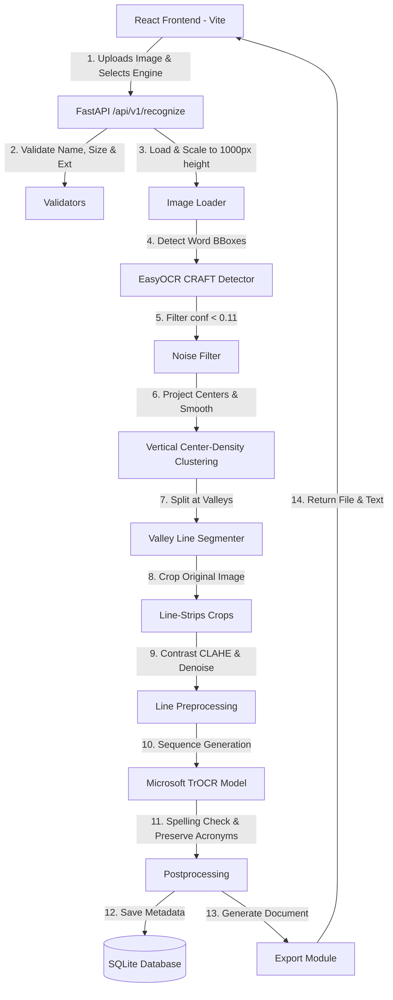
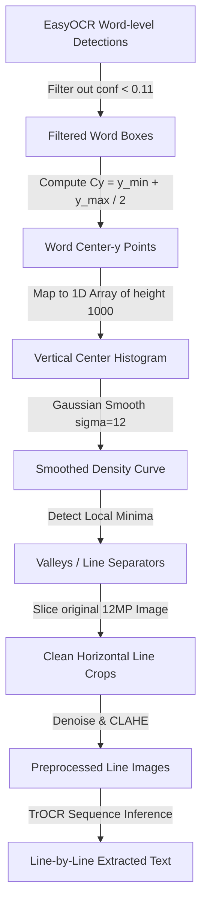

# 🖊️ Handwritten Digital Recognition System (HDRS)

[](LICENSE)
[](https://fastapi.tiangolo.com)
[](https://react.dev)
[](https://pytorch.org)
[](https://huggingface.co/microsoft/trocr-base-handwritten)
[](https://vitejs.dev)

An AI-powered, full-stack Optical Character Recognition (OCR) platform specifically designed and optimized to convert handwritten notes, assignments, documents, journals, and notice boards into editable, searchable, and exportable digital text.

Unlike standard printed-text OCR applications, HDRS combines **Microsoft's Vision-Transformer-based TrOCR model** with a custom **vertical center-density line segmentation** pipeline and a contextual spelling-corrector to transcribe complex, multi-line handwritten records.

---

## 🗺️ System Architecture

The following diagram illustrates the end-to-end data flow of the system:



---

## 🧬 Custom Line Segmentation Algorithm

Microsoft's `trocr-base-handwritten` model is trained exclusively on images of single text lines. If a full multi-line page is fed directly into it, the model fails and outputs repetitive characters (like `o o o o o` or `0 0 0`). 

To solve this, HDRS implements a **Vertical Center-Density Valley Clustering** algorithm:



### Key Advantages:
1. **No Chaining Leakage**: By checking vertical center density peaks, the algorithm never chains adjacent lines together even if words have large vertical ascenders (like `h`, `t`, `l`) or descenders (like `g`, `y`, `p`).
2. **Layout Agnostic**: Works perfectly on left-aligned, right-aligned, or center-aligned layouts (like poems or notice boards).
3. **High Resolution Crops**: Bounding boxes are scaled back to the original 12 Megapixel high-resolution image before cropping, ensuring TrOCR receives high-quality pixel data.

---

## 🗂️ Project Directory Structure

```text
handwritten-digital-recognition-system/
├── .github/
│   └── workflows/
│       └── deploy.yml          # GitHub Actions deployment to GitHub Pages
├── backend/
│   ├── api/
│   │   ├── export.py           # Document export router (PDF, DOCX, TXT, JSON)
│   │   ├── history.py          # OCR History retrieval router
│   │   └── recognize.py        # Core recognition and upload router
│   ├── database/
│   │   ├── database.py         # SQLAlchemy engine & session initialization
│   │   └── models.py           # Document and OCRHistory database schemas
│   ├── ocr/
│   │   ├── confidence.py       # Heuristic and model confidence scorer
│   │   ├── engine_manager.py   # Lazy engine loader (TrOCR, EasyOCR, Tesseract)
│   │   ├── postprocessing.py   # Spelling checker & acronym preservation
│   │   ├── preprocessing.py    # Classic image preprocessing filters
│   │   └── trocr.py            # Line segmentation & TrOCR recognition loop
│   ├── utils/
│   │   ├── constants.py        # Directories, path settings, and constants
│   │   ├── image_loader.py     # Image loading, conversion, and validation
│   │   └── validators.py       # Safe input size, extension, & engine checkers
│   └── app.py                  # FastAPI application setup and middleware
├── frontend/
│   ├── src/
│   │   ├── components/         # Reusable React components (Upload, Result, etc.)
│   │   ├── pages/              # Upload, Results, History, Settings, About pages
│   │   ├── services/           # Axios HTTP request configurations
│   │   ├── utils/              # Client settings and localStorage handlers
│   │   └── App.jsx             # React routing and main frame
│   ├── vite.config.js          # Vite build config with dynamic base path
│   └── package.json            # Node dependencies
├── data/
│   ├── uploads/                # Directory for uploaded images
│   └── samples/                # Sample images for testing
├── LICENSE                     # MIT License file
├── CONTRIBUTING.md             # Project contribution guidelines
└── requirements.txt            # Python dependencies
```

---

## ⚙️ Local Installation & Running

### Prerequisites
- Python 3.10+
- Node.js 18+ (with npm)
- Tesseract OCR (Optional: Only if using Tesseract engine)

### 1. Set Up Backend (FastAPI)
1. Navigate to the project root and create a virtual environment:
   ```bash
   python -m venv .venv
   ```
2. Activate the virtual environment:
   - **Windows (CMD/PowerShell)**:
     ```powershell
     .venv\Scripts\activate
     ```
   - **macOS/Linux**:
     ```bash
     source .venv/bin/activate
     ```
3. Install the dependencies:
   ```bash
   pip install -r requirements.txt
   ```
4. Start the FastAPI server:
   ```bash
   python -m uvicorn backend.app:app --port 8000 --reload
   ```
   The backend will be serving at `http://127.0.0.1:8000`.

### 2. Set Up Frontend (React + Vite)
1. Navigate to the `frontend` folder:
   ```bash
   cd frontend
   ```
2. Install npm dependencies:
   ```bash
   npm install
   ```
3. Start the Vite dev server:
   ```bash
   npm run dev
   ```
   Open `http://localhost:5173` in your web browser.

---

## 🚀 Speeding Up Startup: Running Offline
By default, Hugging Face performs an online check to verify if the local cached version of `microsoft/trocr-base-handwritten` is up to date. This can block backend startup for several minutes if filesystem latency is present.

To bypass this check and load models in **under 1.5 seconds**, configure offline mode by adding this to your environment variables or a `.env` file:
```env
HF_HUB_OFFLINE=1
```

---

## 🌐 Automatic Deployment (GitHub Pages)

The React Vite frontend is configured with a GitHub Actions workflow `.github/workflows/deploy.yml` that builds the application and deploys it to the `gh-pages` branch on every push to `main`. 

Vite dynamically adjusts the base URL to `/handwritten-digital-recognition-system/` during the production build to ensure asset URLs resolve correctly on GitHub Pages.

---

## 🤝 Contributing
Contributions are highly welcomed! Please read our [CONTRIBUTING.md](CONTRIBUTING.md) to understand coding standards, branching strategies, and how to submit pull requests.

---

## 📄 License
This project is licensed under the terms of the [MIT License](LICENSE).
